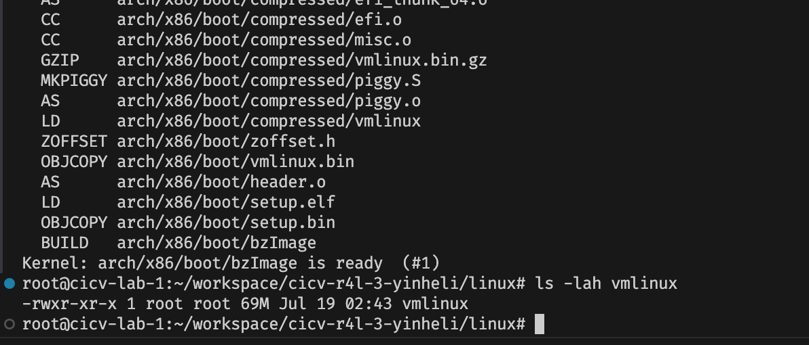

# 作业1：编译Linux内核


```bash
# 预设的配置文件
make x86_64_defconfig

# 指示用 LLVM 来编译内核, 打开交互式的菜单界面，后面用它开 rust 的支持
make LLVM=1 menuconfig

## enable rust support
# General setup
  # ---> [*] Rust support

# build
# 使用 LLVM 工具链进行编译 用全部可用核心数量，并行，从而尽可能地加快编译速度
make LLVM=1 -j$(nproc)
```

build done!


