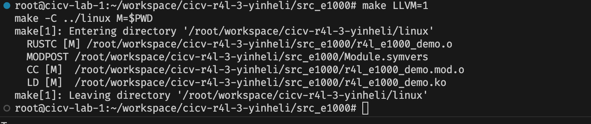
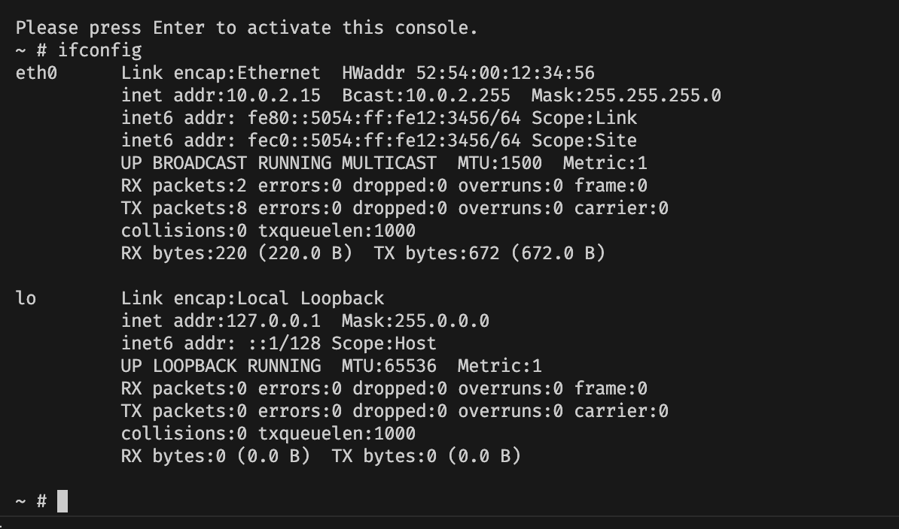
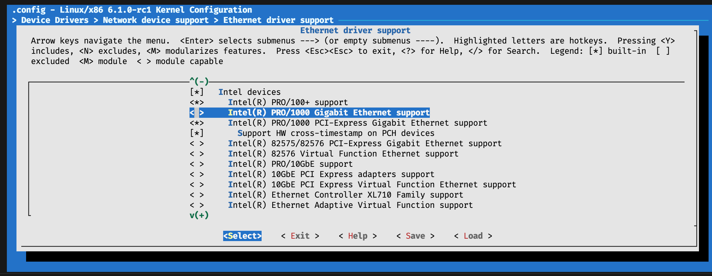
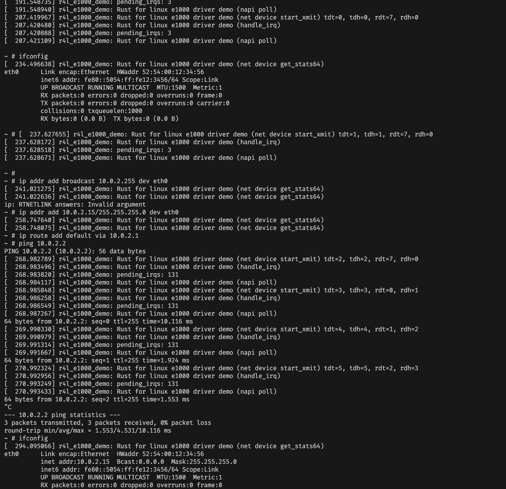

# 作业2：对Linux内核进行一些配置


> Q: 在该文件夹中调用make LLVM=1，该文件夹内的代码将编译成一个内核模块。请结合你学到的知识，回答以下两个问题：
> 1、编译成内核模块，是在哪个文件中以哪条语句定义的？
> 2、该模块位于独立的文件夹内，却能编译成Linux内核模块，这叫做out-of-tree module，请分析它是如何与内核代码产生联系的？

编译

```bash
make LLVM=1
```



> 1、编译成内核模块，是在哪个文件中以哪条语句定义的？

src_e1000 中的 Makefile, 默认会切换到外层的 linux 目录，`$$PWD` 作为绝对路径传递过去，此时 `src_e1000` 是模块的路径，构建的时候，会用 Kbuild 的配置

```Makefile
KDIR ?= ../linux

default:
	$(MAKE) -C $(KDIR) M=$$PWD
```


接下来看 Kbuild 

```Kbuild
obj-m := r4l_e1000_demo.o
```

- obj-m: 这是一个 Kbuild 变量，用于指定要构建的可加载内核模块的目标文件名
- r4l_e1000_demo.o: 这是要构建的内核模块的目标文件名。通常情况下，模块名会与其主要源文件名相匹配

我们开启了 rust 的支持，所以源代码会找到 r4l_e1000_demo.rs

在这个源文件中，通过宏定义了内核模块，后续的就是 rust 相关的代码逻辑了

```rust
module! {
    type: E1000KernelMod,
    name: "r4l_e1000_demo",
    author: "Myrfy001",
    description: "Rust for linux e1000 driver demo",
    license: "GPL",
}
```

> 2、该模块位于独立的文件夹内，却能编译成Linux内核模块，这叫做out-of-tree module，请分析它是如何与内核代码产生联系的？


- 我们自己写的模块 （Out-of-tree 模块）包含模块代码和 Kbuild 文件，用于描述模块的编译规则和依赖关系
- make 的时候通过 -C 切换到内核文件夹，利用内核的构建系统，-M 传递模块的文件夹


执行 `build_image.sh` 进入到 linux (qemu 模拟器)

```bash
bash build_image.sh
```




关掉 Device Drivers > Network device support > Ethernet driver support > Intel devices, Intel(R) PRO/1000 Gigabit Ethernet support


重新编译内核

```bash
make LLVM=1 -j$(nproc)
```

```log
  SYNC    include/config/auto.conf.cmd
  DESCEND objtool
  CALL    scripts/checksyscalls.sh
  RUSTC L rust/bindings.o
  EXPORTS rust/exports_bindings_generated.h
  RUSTC L rust/kernel.o
  EXPORTS rust/exports_kernel_generated.h
  CC      rust/exports.o
  AR      rust/built-in.a
  AR      drivers/net/ethernet/intel/built-in.a
  AR      drivers/net/ethernet/built-in.a
  AR      drivers/net/built-in.a
  AR      drivers/built-in.a
  AR      built-in.a
  AR      vmlinux.a
  LD      vmlinux.o
  OBJCOPY modules.builtin.modinfo
  GEN     modules.builtin
  MODPOST Module.symvers
  UPD     include/generated/utsversion.h
  CC      init/version-timestamp.o
  LD      .tmp_vmlinux.kallsyms1
  NM      .tmp_vmlinux.kallsyms1.syms
  KSYMS   .tmp_vmlinux.kallsyms1.S
  AS      .tmp_vmlinux.kallsyms1.S
  LD      .tmp_vmlinux.kallsyms2
  NM      .tmp_vmlinux.kallsyms2.syms
  KSYMS   .tmp_vmlinux.kallsyms2.S
  AS      .tmp_vmlinux.kallsyms2.S
  LD      vmlinux
  NM      System.map
  SORTTAB vmlinux
  CC      arch/x86/boot/version.o
  VOFFSET arch/x86/boot/compressed/../voffset.h
  OBJCOPY arch/x86/boot/compressed/vmlinux.bin
  RELOCS  arch/x86/boot/compressed/vmlinux.relocs
  CC      arch/x86/boot/compressed/kaslr.o
  GZIP    arch/x86/boot/compressed/vmlinux.bin.gz
  CC      arch/x86/boot/compressed/misc.o
  MKPIGGY arch/x86/boot/compressed/piggy.S
  AS      arch/x86/boot/compressed/piggy.o
  LD      arch/x86/boot/compressed/vmlinux
  ZOFFSET arch/x86/boot/zoffset.h
  OBJCOPY arch/x86/boot/vmlinux.bin
  AS      arch/x86/boot/header.o
  LD      arch/x86/boot/setup.elf
  OBJCOPY arch/x86/boot/setup.bin
  BUILD   arch/x86/boot/bzImage
Kernel: arch/x86/boot/bzImage is ready  (#2)
```

重新进入到 linux 

```bash
bash build_image.sh
```

```log
[    0.000000] Linux version 6.1.0-rc1 (root@cicv-lab-1) (Debian clang version 14.0.6, Debian LLD 14.0.6) #2 SMP PREEMPT_DYNAMIC Fri Jul 19 03:25:4
[    0.000000] Command line: root=/dev/ram rdinit=sbin/init ip=10.0.2.15::10.0.2.1:255.255.255.0 console=ttyS0 no_timer_check
[    0.000000] x86/fpu: x87 FPU will use FXSAVE
[    0.000000] signal: max sigframe size: 1440
[    0.000000] BIOS-provided physical RAM map:
[    0.000000] BIOS-e820: [mem 0x0000000000000000-0x000000000009fbff] usable
[    0.000000] BIOS-e820: [mem 0x000000000009fc00-0x000000000009ffff] reserved
[    0.000000] BIOS-e820: [mem 0x00000000000f0000-0x00000000000fffff] reserved
[    0.000000] BIOS-e820: [mem 0x0000000000100000-0x0000000007fdffff] usable
[    0.000000] BIOS-e820: [mem 0x0000000007fe0000-0x0000000007ffffff] reserved
[    0.000000] BIOS-e820: [mem 0x00000000fffc0000-0x00000000ffffffff] reserved
[    0.000000] BIOS-e820: [mem 0x000000fd00000000-0x000000ffffffffff] reserved
[    0.000000] NX (Execute Disable) protection: active
[    0.000000] SMBIOS 2.8 present.
[    0.000000] DMI: QEMU Standard PC (i440FX + PIIX, 1996), BIOS 1.16.2-debian-1.16.2-1 04/01/2014
[    0.000000] tsc: Fast TSC calibration using PIT
[    0.000000] tsc: Detected 3892.682 MHz processor
[    0.005492] last_pfn = 0x7fe0 max_arch_pfn = 0x400000000
[    0.006095] x86/PAT: Configuration [0-7]: WB  WC  UC- UC  WB  WP  UC- WT  
[    0.013896] found SMP MP-table at [mem 0x000f5ba0-0x000f5baf]
[    0.017470] RAMDISK: [mem 0x07d90000-0x07fdffff]
[    0.018323] ACPI: Early table checksum verification disabled
[    0.018528] ACPI: RSDP 0x00000000000F59D0 000014 (v00 BOCHS )
[    0.018727] ACPI: RSDT 0x0000000007FE1AC6 000034 (v01 BOCHS  BXPC     00000001 BXPC 00000001)
[    0.019131] ACPI: FACP 0x0000000007FE197A 000074 (v01 BOCHS  BXPC     00000001 BXPC 00000001)
[    0.019503] ACPI: DSDT 0x0000000007FE0040 00193A (v01 BOCHS  BXPC     00000001 BXPC 00000001)
[    0.019556] ACPI: FACS 0x0000000007FE0000 000040
[    0.019586] ACPI: APIC 0x0000000007FE19EE 000078 (v01 BOCHS  BXPC     00000001 BXPC 00000001)
[    0.019600] ACPI: HPET 0x0000000007FE1A66 000038 (v01 BOCHS  BXPC     00000001 BXPC 00000001)
[    0.019612] ACPI: WAET 0x0000000007FE1A9E 000028 (v01 BOCHS  BXPC     00000001 BXPC 00000001)
[    0.019657] ACPI: Reserving FACP table memory at [mem 0x7fe197a-0x7fe19ed]
[    0.019674] ACPI: Reserving DSDT table memory at [mem 0x7fe0040-0x7fe1979]
[    0.019678] ACPI: Reserving FACS table memory at [mem 0x7fe0000-0x7fe003f]
[    0.019682] ACPI: Reserving APIC table memory at [mem 0x7fe19ee-0x7fe1a65]
[    0.019685] ACPI: Reserving HPET table memory at [mem 0x7fe1a66-0x7fe1a9d]
[    0.019688] ACPI: Reserving WAET table memory at [mem 0x7fe1a9e-0x7fe1ac5]
[    0.020906] No NUMA configuration found
[    0.020919] Faking a node at [mem 0x0000000000000000-0x0000000007fdffff]
[    0.021383] NODE_DATA(0) allocated [mem 0x07d8c000-0x07d8ffff]
[    0.022845] Zone ranges:
[    0.022854]   DMA      [mem 0x0000000000001000-0x0000000000ffffff]
[    0.022948]   DMA32    [mem 0x0000000001000000-0x0000000007fdffff]
[    0.022954]   Normal   empty
[    0.022966] Movable zone start for each node
[    0.022985] Early memory node ranges
[    0.023004]   node   0: [mem 0x0000000000001000-0x000000000009efff]
[    0.023149]   node   0: [mem 0x0000000000100000-0x0000000007fdffff]
[    0.023289] Initmem setup node 0 [mem 0x0000000000001000-0x0000000007fdffff]
[    0.024014] On node 0, zone DMA: 1 pages in unavailable ranges
[    0.024236] On node 0, zone DMA: 97 pages in unavailable ranges
[    0.024983] On node 0, zone DMA32: 32 pages in unavailable ranges
[    0.025240] ACPI: PM-Timer IO Port: 0x608
[    0.025569] ACPI: LAPIC_NMI (acpi_id[0xff] dfl dfl lint[0x1])
[    0.025821] IOAPIC[0]: apic_id 0, version 32, address 0xfec00000, GSI 0-23
[    0.025893] ACPI: INT_SRC_OVR (bus 0 bus_irq 0 global_irq 2 dfl dfl)
[    0.026051] ACPI: INT_SRC_OVR (bus 0 bus_irq 5 global_irq 5 high level)
[    0.026076] ACPI: INT_SRC_OVR (bus 0 bus_irq 9 global_irq 9 high level)
[    0.026131] ACPI: INT_SRC_OVR (bus 0 bus_irq 10 global_irq 10 high level)
[    0.026137] ACPI: INT_SRC_OVR (bus 0 bus_irq 11 global_irq 11 high level)
[    0.026278] ACPI: Using ACPI (MADT) for SMP configuration information
[    0.026305] ACPI: HPET id: 0x8086a201 base: 0xfed00000
[    0.026508] smpboot: Allowing 1 CPUs, 0 hotplug CPUs
[    0.027084] PM: hibernation: Registered nosave memory: [mem 0x00000000-0x00000fff]
[    0.027115] PM: hibernation: Registered nosave memory: [mem 0x0009f000-0x0009ffff]
[    0.027139] PM: hibernation: Registered nosave memory: [mem 0x000a0000-0x000effff]
[    0.027142] PM: hibernation: Registered nosave memory: [mem 0x000f0000-0x000fffff]
[    0.027226] [mem 0x08000000-0xfffbffff] available for PCI devices
[    0.027246] Booting paravirtualized kernel on bare hardware
[    0.027448] clocksource: refined-jiffies: mask: 0xffffffff max_cycles: 0xffffffff, max_idle_ns: 1910969940391419 ns
[    0.035047] setup_percpu: NR_CPUS:64 nr_cpumask_bits:1 nr_cpu_ids:1 nr_node_ids:1
[    0.036215] percpu: Embedded 52 pages/cpu s175720 r8192 d29080 u2097152
[    0.037803] Fallback order for Node 0: 0 
[    0.037966] Built 1 zonelists, mobility grouping on.  Total pages: 31968
[    0.037984] Policy zone: DMA32
[    0.038128] Kernel command line: root=/dev/ram rdinit=sbin/init ip=10.0.2.15::10.0.2.1:255.255.255.0 console=ttyS0 no_timer_check
[    0.039260] Dentry cache hash table entries: 16384 (order: 5, 131072 bytes, linear)
[    0.039335] Inode-cache hash table entries: 8192 (order: 4, 65536 bytes, linear)
[    0.040205] mem auto-init: stack:all(zero), heap alloc:off, heap free:off
[    0.043957] Memory: 89896K/130552K available (16396K kernel code, 2545K rwdata, 5304K rodata, 1328K init, 1408K bss, 40396K reserved, 0K cma-re)
[    0.046324] SLUB: HWalign=64, Order=0-3, MinObjects=0, CPUs=1, Nodes=1
[    0.053351] Dynamic Preempt: voluntary
[    0.055505] rcu: Preemptible hierarchical RCU implementation.
[    0.055515] rcu:     RCU event tracing is enabled.
[    0.055533] rcu:     RCU restricting CPUs from NR_CPUS=64 to nr_cpu_ids=1.
[    0.055614]  Trampoline variant of Tasks RCU enabled.
[    0.055671] rcu: RCU calculated value of scheduler-enlistment delay is 100 jiffies.
[    0.055689] rcu: Adjusting geometry for rcu_fanout_leaf=16, nr_cpu_ids=1
[    0.061380] NR_IRQS: 4352, nr_irqs: 256, preallocated irqs: 16
[    0.065094] rcu: srcu_init: Setting srcu_struct sizes based on contention.
[    0.069080] Console: colour VGA+ 80x25
[    0.084969] printk: console [ttyS0] enabled
[    0.085723] ACPI: Core revision 20220331
[    0.089209] clocksource: hpet: mask: 0xffffffff max_cycles: 0xffffffff, max_idle_ns: 19112604467 ns
[    0.093259] APIC: Switch to symmetric I/O mode setup
[    0.095958] ..TIMER: vector=0x30 apic1=0 pin1=2 apic2=-1 pin2=-1
[    0.096860] clocksource: tsc-early: mask: 0xffffffffffffffff max_cycles: 0x7038b2b5521, max_idle_ns: 881590892899 ns
[    0.097605] Calibrating delay loop (skipped), value calculated using timer frequency.. 7785.36 BogoMIPS (lpj=3892682)
[    0.098106] pid_max: default: 32768 minimum: 301
[    0.099079] LSM: Security Framework initializing
[    0.099846] SELinux:  Initializing.
[    0.101276] Mount-cache hash table entries: 512 (order: 0, 4096 bytes, linear)
[    0.101466] Mountpoint-cache hash table entries: 512 (order: 0, 4096 bytes, linear)
[    0.115240] process: using AMD E400 aware idle routine
[    0.115506] Last level iTLB entries: 4KB 512, 2MB 255, 4MB 127
[    0.115665] Last level dTLB entries: 4KB 512, 2MB 255, 4MB 127, 1GB 0
[    0.116010] Spectre V1 : Mitigation: usercopy/swapgs barriers and __user pointer sanitization
[    0.116351] Spectre V2 : Mitigation: Retpolines
[    0.116448] Spectre V2 : Spectre v2 / SpectreRSB mitigation: Filling RSB on context switch
[    0.116698] Spectre V2 : Spectre v2 / SpectreRSB : Filling RSB on VMEXIT
[    0.314448] Freeing SMP alternatives memory: 52K
[    0.425111] smpboot: CPU0: AMD QEMU Virtual CPU version 2.5+ (family: 0xf, model: 0x6b, stepping: 0x1)
[    0.429245] cblist_init_generic: Setting adjustable number of callback queues.
[    0.429467] cblist_init_generic: Setting shift to 0 and lim to 1.
[    0.429905] Performance Events: PMU not available due to virtualization, using software events only.
[    0.431603] rcu: Hierarchical SRCU implementation.
[    0.431752] rcu:     Max phase no-delay instances is 400.
[    0.436172] smp: Bringing up secondary CPUs ...
[    0.436372] smp: Brought up 1 node, 1 CPU
[    0.436523] smpboot: Max logical packages: 1
[    0.436714] smpboot: Total of 1 processors activated (7785.36 BogoMIPS)
[    0.445733] devtmpfs: initialized
[    0.450916] clocksource: jiffies: mask: 0xffffffff max_cycles: 0xffffffff, max_idle_ns: 1911260446275000 ns
[    0.451318] futex hash table entries: 256 (order: 2, 16384 bytes, linear)
[    0.453190] PM: RTC time: 10:26:42, date: 2024-07-19
[    0.456511] NET: Registered PF_NETLINK/PF_ROUTE protocol family
[    0.458659] audit: initializing netlink subsys (disabled)
[    0.462695] audit: type=2000 audit(1721384801.368:1): state=initialized audit_enabled=0 res=1
[    0.463286] thermal_sys: Registered thermal governor 'step_wise'
[    0.463317] thermal_sys: Registered thermal governor 'user_space'
[    0.465165] cpuidle: using governor menu
[    0.467882] PCI: Using configuration type 1 for base access
[    0.485915] kprobes: kprobe jump-optimization is enabled. All kprobes are optimized if possible.
[    0.810324] HugeTLB: registered 2.00 MiB page size, pre-allocated 0 pages
[    0.810456] HugeTLB: 28 KiB vmemmap can be freed for a 2.00 MiB page
[    0.814967] ACPI: Added _OSI(Module Device)
[    0.815136] ACPI: Added _OSI(Processor Device)
[    0.815277] ACPI: Added _OSI(3.0 _SCP Extensions)
[    0.815433] ACPI: Added _OSI(Processor Aggregator Device)
[    0.824732] ACPI: 1 ACPI AML tables successfully acquired and loaded
[    0.835791] ACPI: Interpreter enabled
[    0.836701] ACPI: PM: (supports S0 S3 S4 S5)
[    0.836855] ACPI: Using IOAPIC for interrupt routing
[    0.837292] PCI: Using host bridge windows from ACPI; if necessary, use "pci=nocrs" and report a bug
[    0.837460] PCI: Using E820 reservations for host bridge windows
[    0.838696] ACPI: Enabled 2 GPEs in block 00 to 0F
[    0.860293] ACPI: PCI Root Bridge [PCI0] (domain 0000 [bus 00-ff])
[    0.860931] acpi PNP0A03:00: _OSC: OS supports [ASPM ClockPM Segments MSI HPX-Type3]
[    0.861295] acpi PNP0A03:00: _OSC: not requesting OS control; OS requires [ExtendedConfig ASPM ClockPM MSI]
[    0.861865] acpi PNP0A03:00: fail to add MMCONFIG information, can't access extended PCI configuration space under this bridge.
[    0.864899] PCI host bridge to bus 0000:00
[    0.865112] pci_bus 0000:00: root bus resource [io  0x0000-0x0cf7 window]
[    0.865396] pci_bus 0000:00: root bus resource [io  0x0d00-0xffff window]
[    0.865440] pci_bus 0000:00: root bus resource [mem 0x000a0000-0x000bffff window]
[    0.865666] pci_bus 0000:00: root bus resource [mem 0x08000000-0xfebfffff window]
[    0.865890] pci_bus 0000:00: root bus resource [mem 0x100000000-0x17fffffff window]
[    0.866205] pci_bus 0000:00: root bus resource [bus 00-ff]
[    0.867457] pci 0000:00:00.0: [8086:1237] type 00 class 0x060000
[    0.873079] pci 0000:00:01.0: [8086:7000] type 00 class 0x060100
[    0.875556] pci 0000:00:01.1: [8086:7010] type 00 class 0x010180
[    0.877559] pci 0000:00:01.1: reg 0x20: [io  0xc040-0xc04f]
[    0.878450] pci 0000:00:01.1: legacy IDE quirk: reg 0x10: [io  0x01f0-0x01f7]
[    0.878695] pci 0000:00:01.1: legacy IDE quirk: reg 0x14: [io  0x03f6]
[    0.878941] pci 0000:00:01.1: legacy IDE quirk: reg 0x18: [io  0x0170-0x0177]
[    0.879176] pci 0000:00:01.1: legacy IDE quirk: reg 0x1c: [io  0x0376]
[    0.879770] pci 0000:00:01.3: [8086:7113] type 00 class 0x068000
[    0.880239] pci 0000:00:01.3: quirk: [io  0x0600-0x063f] claimed by PIIX4 ACPI
[    0.880460] pci 0000:00:01.3: quirk: [io  0x0700-0x070f] claimed by PIIX4 SMB
[    0.880968] pci 0000:00:02.0: [1234:1111] type 00 class 0x030000
[    0.881738] pci 0000:00:02.0: reg 0x10: [mem 0xfd000000-0xfdffffff pref]
[    0.883096] pci 0000:00:02.0: reg 0x18: [mem 0xfebf0000-0xfebf0fff]
[    0.885739] pci 0000:00:02.0: reg 0x30: [mem 0xfebe0000-0xfebeffff pref]
[    0.886150] pci 0000:00:02.0: Video device with shadowed ROM at [mem 0x000c0000-0x000dffff]
[    0.889519] pci 0000:00:03.0: [8086:100e] type 00 class 0x020000
[    0.890454] pci 0000:00:03.0: reg 0x10: [mem 0xfebc0000-0xfebdffff]
[    0.891446] pci 0000:00:03.0: reg 0x14: [io  0xc000-0xc03f]
[    0.894441] pci 0000:00:03.0: reg 0x30: [mem 0xfeb80000-0xfebbffff pref]
[    0.900458] ACPI: PCI: Interrupt link LNKA configured for IRQ 10
[    0.901128] ACPI: PCI: Interrupt link LNKB configured for IRQ 10
[    0.901666] ACPI: PCI: Interrupt link LNKC configured for IRQ 11
[    0.902144] ACPI: PCI: Interrupt link LNKD configured for IRQ 11
[    0.902542] ACPI: PCI: Interrupt link LNKS configured for IRQ 9
[    0.905183] iommu: Default domain type: Translated 
[    0.905393] iommu: DMA domain TLB invalidation policy: lazy mode 
[    0.906828] SCSI subsystem initialized
[    0.908068] ACPI: bus type USB registered
[    0.908513] usbcore: registered new interface driver usbfs
[    0.908864] usbcore: registered new interface driver hub
[    0.909148] usbcore: registered new device driver usb
[    0.909626] pps_core: LinuxPPS API ver. 1 registered
[    0.909815] pps_core: Software ver. 5.3.6 - Copyright 2005-2007 Rodolfo Giometti <giometti@linux.it>
[    0.910188] PTP clock support registered
[    0.911514] Advanced Linux Sound Architecture Driver Initialized.
[    0.918138] NetLabel: Initializing
[    0.918272] NetLabel:  domain hash size = 128
[    0.918433] NetLabel:  protocols = UNLABELED CIPSOv4 CALIPSO
[    0.919178] NetLabel:  unlabeled traffic allowed by default
[    0.921921] PCI: Using ACPI for IRQ routing
[    0.923145] pci 0000:00:02.0: vgaarb: setting as boot VGA device
[    0.923380] pci 0000:00:02.0: vgaarb: bridge control possible
[    0.923426] pci 0000:00:02.0: vgaarb: VGA device added: decodes=io+mem,owns=io+mem,locks=none
[    0.923464] vgaarb: loaded
[    0.924599] hpet: 3 channels of 0 reserved for per-cpu timers
[    0.925185] hpet0: at MMIO 0xfed00000, IRQs 2, 8, 0
[    0.925433] hpet0: 3 comparators, 64-bit 100.000000 MHz counter
[    0.928845] clocksource: Switched to clocksource tsc-early
[    0.930390] VFS: Disk quotas dquot_6.6.0
[    0.930691] VFS: Dquot-cache hash table entries: 512 (order 0, 4096 bytes)
[    0.932567] pnp: PnP ACPI init
[    0.935654] pnp: PnP ACPI: found 6 devices
[    0.951221] clocksource: acpi_pm: mask: 0xffffff max_cycles: 0xffffff, max_idle_ns: 2085701024 ns
[    0.951854] NET: Registered PF_INET protocol family
[    0.952794] IP idents hash table entries: 2048 (order: 2, 16384 bytes, linear)
[    0.957092] tcp_listen_portaddr_hash hash table entries: 256 (order: 0, 4096 bytes, linear)
[    0.957436] Table-perturb hash table entries: 65536 (order: 6, 262144 bytes, linear)
[    0.957719] TCP established hash table entries: 1024 (order: 1, 8192 bytes, linear)
[    0.958061] TCP bind hash table entries: 1024 (order: 3, 32768 bytes, linear)
[    0.958346] TCP: Hash tables configured (established 1024 bind 1024)
[    0.959197] UDP hash table entries: 256 (order: 1, 8192 bytes, linear)
[    0.959563] UDP-Lite hash table entries: 256 (order: 1, 8192 bytes, linear)
[    0.960794] NET: Registered PF_UNIX/PF_LOCAL protocol family
[    0.962282] RPC: Registered named UNIX socket transport module.
[    0.962465] RPC: Registered udp transport module.
[    0.962679] RPC: Registered tcp transport module.
[    0.962827] RPC: Registered tcp NFSv4.1 backchannel transport module.
[    0.964317] pci_bus 0000:00: resource 4 [io  0x0000-0x0cf7 window]
[    0.964508] pci_bus 0000:00: resource 5 [io  0x0d00-0xffff window]
[    0.964696] pci_bus 0000:00: resource 6 [mem 0x000a0000-0x000bffff window]
[    0.964908] pci_bus 0000:00: resource 7 [mem 0x08000000-0xfebfffff window]
[    0.965098] pci_bus 0000:00: resource 8 [mem 0x100000000-0x17fffffff window]
[    0.965665] pci 0000:00:01.0: PIIX3: Enabling Passive Release
[    0.965903] pci 0000:00:00.0: Limiting direct PCI/PCI transfers
[    0.966163] PCI: CLS 0 bytes, default 64
[    0.970097] Unpacking initramfs...
[    1.000943] Freeing initrd memory: 2368K
[    1.066811] Initialise system trusted keyrings
[    1.069244] workingset: timestamp_bits=56 max_order=15 bucket_order=0
[    1.079845] NFS: Registering the id_resolver key type
[    1.080195] Key type id_resolver registered
[    1.080331] Key type id_legacy registered
[    1.081002] 9p: Installing v9fs 9p2000 file system support
[    1.102365] Key type asymmetric registered
[    1.102583] Asymmetric key parser 'x509' registered
[    1.102895] Block layer SCSI generic (bsg) driver version 0.4 loaded (major 251)
[    1.103312] io scheduler mq-deadline registered
[    1.103503] io scheduler kyber registered
[    1.105724] input: Power Button as /devices/LNXSYSTM:00/LNXPWRBN:00/input/input0
[    1.109588] ACPI: button: Power Button [PWRF]
[    1.112354] Serial: 8250/16550 driver, 4 ports, IRQ sharing enabled
[    1.113920] 00:04: ttyS0 at I/O 0x3f8 (irq = 4, base_baud = 115200) is a 16550A
[    1.117566] Non-volatile memory driver v1.3
[    1.117708] Linux agpgart interface v0.103
[    1.119177] ACPI: bus type drm_connector registered
[    1.132763] loop: module loaded
[    1.138768] scsi host0: ata_piix
[    1.140323] scsi host1: ata_piix
[    1.140754] ata1: PATA max MWDMA2 cmd 0x1f0 ctl 0x3f6 bmdma 0xc040 irq 14
[    1.140977] ata2: PATA max MWDMA2 cmd 0x170 ctl 0x376 bmdma 0xc048 irq 15
[    1.145239] e100: Intel(R) PRO/100 Network Driver
[    1.145382] e100: Copyright(c) 1999-2006 Intel Corporation
[    1.145655] e1000e: Intel(R) PRO/1000 Network Driver
[    1.145815] e1000e: Copyright(c) 1999 - 2015 Intel Corporation.
[    1.146040] sky2: driver version 1.30
[    1.147544] usbcore: registered new interface driver usblp
[    1.147759] usbcore: registered new interface driver usb-storage
[    1.148485] i8042: PNP: PS/2 Controller [PNP0303:KBD,PNP0f13:MOU] at 0x60,0x64 irq 1,12
[    1.150696] serio: i8042 KBD port at 0x60,0x64 irq 1
[    1.150971] serio: i8042 AUX port at 0x60,0x64 irq 12
[    1.153829] input: AT Translated Set 2 keyboard as /devices/platform/i8042/serio0/input/input1
[    1.160127] rtc_cmos 00:05: registered as rtc0
[    1.160456] rtc_cmos 00:05: alarms up to one day, 242 bytes nvram, hpet irqs
[    1.161023] rtc_cmos 00:05: RTC can wake from S4
[    1.161552] fail to initialize ptp_kvm
[    1.162113] device-mapper: ioctl: 4.47.0-ioctl (2022-07-28) initialised: dm-devel@redhat.com
[    1.162942] hid: raw HID events driver (C) Jiri Kosina
[    1.164161] usbcore: registered new interface driver usbhid
[    1.164353] usbhid: USB HID core driver
[    1.169431] Initializing XFRM netlink socket
[    1.170361] NET: Registered PF_INET6 protocol family
[    1.175032] Segment Routing with IPv6
[    1.175245] In-situ OAM (IOAM) with IPv6
[    1.176094] sit: IPv6, IPv4 and MPLS over IPv4 tunneling driver
[    1.178243] NET: Registered PF_PACKET protocol family
[    1.179333] 9pnet: Installing 9P2000 support
[    1.179974] Key type dns_resolver registered
[    1.181178] IPI shorthand broadcast: enabled
[    1.181577] sched_clock: Marking stable (1155494568, 25975419)->(1204600606, -23130619)
[    1.182827] registered taskstats version 1
[    1.182960] Loading compiled-in X.509 certificates
[    1.187331] cryptomgr_test (44) used greatest stack depth: 15584 bytes left
[    1.192904] PM:   Magic number: 0:867:426
[    1.193536] printk: console [netcon0] enabled
[    1.193733] netconsole: network logging started
[    1.300654] ata2: found unknown device (class 0)
[    1.304214] ata2.00: ATAPI: QEMU DVD-ROM, 2.5+, max UDMA/100
[    1.311205] scsi 1:0:0:0: CD-ROM            QEMU     QEMU DVD-ROM     2.5+ PQ: 0 ANSI: 5
[    1.343874] sr 1:0:0:0: [sr0] scsi3-mmc drive: 4x/4x cd/rw xa/form2 tray
[    1.344182] cdrom: Uniform CD-ROM driver Revision: 3.20
[    1.361628] sr 1:0:0:0: Attached scsi generic sg0 type 5
[    1.781117] input: ImExPS/2 Generic Explorer Mouse as /devices/platform/i8042/serio1/input/input3
[    1.980007] tsc: Refined TSC clocksource calibration: 3892.621 MHz
[    1.980355] clocksource: tsc: mask: 0xffffffffffffffff max_cycles: 0x70383ddfda8, max_idle_ns: 881590677559 ns
[    1.980753] clocksource: Switched to clocksource tsc
[   14.076083] cfg80211: Loading compiled-in X.509 certificates for regulatory database
[   14.115236] modprobe (67) used greatest stack depth: 14272 bytes left
[   14.123921] cfg80211: Loaded X.509 cert 'sforshee: 00b28ddf47aef9cea7'
[   14.125145] platform regulatory.0: Direct firmware load for regulatory.db failed with error -2
[   14.125591] cfg80211: failed to load regulatory.db
[   14.126599] ALSA device list:
[   14.126824]   No soundcards found.
[   14.179283] Freeing unused kernel image (initmem) memory: 1328K
[   14.180591] Write protecting the kernel read-only data: 24576k
[   14.182903] Freeing unused kernel image (text/rodata gap) memory: 2032K
[   14.183625] Freeing unused kernel image (rodata/data gap) memory: 840K
[   14.291553] x86/mm: Checked W+X mappings: passed, no W+X pages found.
[   14.291928] Run sbin/init as init process
[   14.318115] mount (72) used greatest stack depth: 14160 bytes left
[   14.399811] mdev (74) used greatest stack depth: 13928 bytes left

Please press Enter to activate this console. 
~ # 
```

再次查看网络信息

```bash
ifconfig
```

此时什么都没有

```bash
# 加载模块
insmod r4l_e1000_demo.ko
```

```log
[  127.638995] r4l_e1000_demo: loading out-of-tree module taints kernel.
[  127.643876] r4l_e1000_demo: Rust for linux e1000 driver demo (init)
[  127.644355] r4l_e1000_demo: Rust for linux e1000 driver demo (probe): None
[  127.789012] ACPI: \_SB_.LNKC: Enabled at IRQ 11
[  127.810237] r4l_e1000_demo: Rust for linux e1000 driver demo (net device get_stats64)
[  127.811901] insmod (81) used greatest stack depth: 11144 bytes left
```

设置网络

> 设置的时候有日志输出


```
ip link set eth0 up
ip addr add broadcast 10.0.2.255 dev eth0
ip addr add 10.0.2.15/255.255.255.0 dev eth0 
ip route add default via 10.0.2.1
```




网卡驱动能够正常ping通网络。

> 添加 broadcast 报错，ifconfig 检查发现也确实没成功设置，待查


