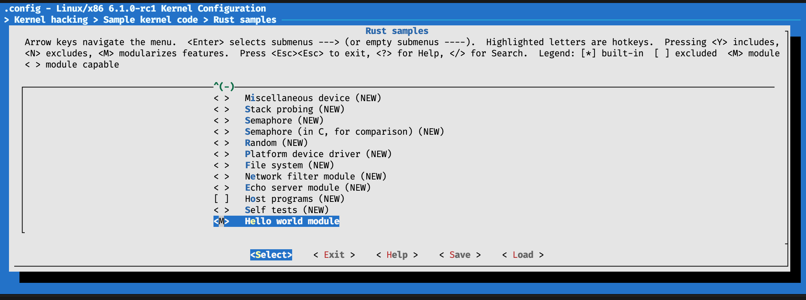
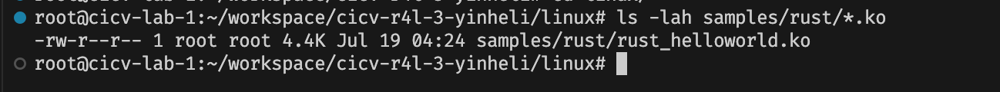
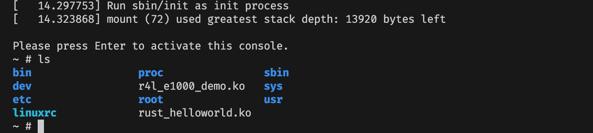
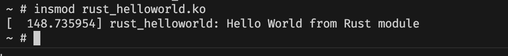

# 作业3：使用rust编写一个简单的内核模块并运行


根据已有的模块配置 helloworld 模块，使用 `tristate` 配置为 `M` 模块，如图



构建

```bash
make LLVM=1 -j$(nproc)
```

```log
  SYNC    include/config/auto.conf.cmd
  DESCEND objtool
  CALL    scripts/checksyscalls.sh
  AR      samples/vfio-mdev/built-in.a
  AR      samples/rust/built-in.a
  RUSTC [M] samples/rust/rust_helloworld.o
  AR      samples/built-in.a
  AR      built-in.a
  AR      vmlinux.a
  LD      vmlinux.o
  OBJCOPY modules.builtin.modinfo
  GEN     modules.builtin
  MODPOST Module.symvers
  CC [M]  samples/rust/rust_helloworld.mod.o
  UPD     include/generated/utsversion.h
  CC      init/version-timestamp.o
  LD      .tmp_vmlinux.kallsyms1
  LD [M]  samples/rust/rust_helloworld.ko
  NM      .tmp_vmlinux.kallsyms1.syms
  KSYMS   .tmp_vmlinux.kallsyms1.S
  AS      .tmp_vmlinux.kallsyms1.S
  LD      .tmp_vmlinux.kallsyms2
  NM      .tmp_vmlinux.kallsyms2.syms
  KSYMS   .tmp_vmlinux.kallsyms2.S
  AS      .tmp_vmlinux.kallsyms2.S
  LD      vmlinux
  NM      System.map
  SORTTAB vmlinux
  CC      arch/x86/boot/version.o
  VOFFSET arch/x86/boot/compressed/../voffset.h
  OBJCOPY arch/x86/boot/compressed/vmlinux.bin
  RELOCS  arch/x86/boot/compressed/vmlinux.relocs
  CC      arch/x86/boot/compressed/kaslr.o
  GZIP    arch/x86/boot/compressed/vmlinux.bin.gz
  CC      arch/x86/boot/compressed/misc.o
  MKPIGGY arch/x86/boot/compressed/piggy.S
  AS      arch/x86/boot/compressed/piggy.o
  LD      arch/x86/boot/compressed/vmlinux
  ZOFFSET arch/x86/boot/zoffset.h
  OBJCOPY arch/x86/boot/vmlinux.bin
  AS      arch/x86/boot/header.o
  LD      arch/x86/boot/setup.elf
  OBJCOPY arch/x86/boot/setup.bin
  BUILD   arch/x86/boot/bzImage
Kernel: arch/x86/boot/bzImage is ready  (#3)
```

看到模块已经编译出来




```bash
# 拷贝到 rootfs
cp samples/rust/rust_helloworld.ko ../src_e1000/rootfs

cd ../src_e1000/

# 启动
bash build_image.sh
```

``` bash
ls
```

根下多了 `rust_helloworld.ko` 模块




```bash
# 加载模块，看到 hello world 的输出
insmod rust_helloworld.ko
```


