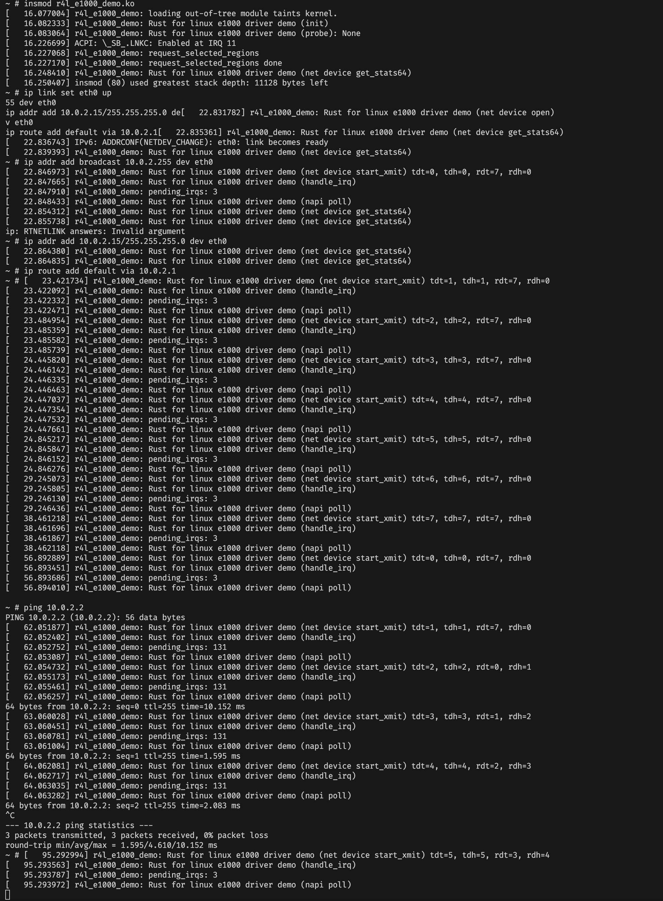
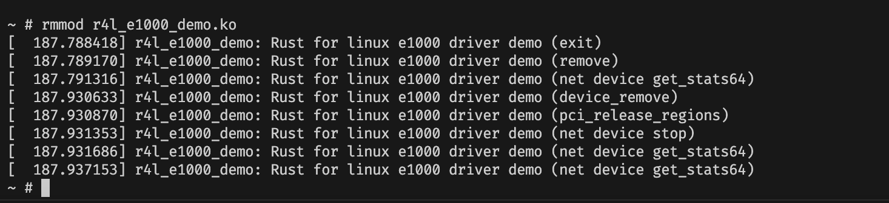

# 作业4：为e1000网卡驱动添加remove代码

代码调整

- 调整 pci 模块，增加 release 的支持，详见 commit: https://github.com/cicvedu/cicv-r4l-3-yinheli/commit/3a93011219c9a74744bcd2f9a7b08e33b7a7c23b 
- 

重新编译内核 & r4l_e1000_demo 模块，下面开始用 busybox 实验


加载模块 & 配置 & 测试网络

```bash
insmod r4l_e1000_demo.ko

ip link set eth0 up
ip addr add 10.0.2.15/255.255.255.0 dev eth0 
ip route add default via 10.0.2.1

ping 10.0.2.2
```



卸载


```bash
rmmod r4l_e1000_demo.ko
```




再次加载模块并配置和测试网络


```bash
insmod r4l_e1000_demo.ko


ip link set eth0 up
ip addr add 10.0.2.15/255.255.255.0 dev eth0 
ip route add default via 10.0.2.1

ping 10.0.2.2
```

> [!CAUTION]
> 目前卸载再次加载释放 DMA 还有点问题

```
[   23.056855][   T86] r4l_e1000_demo: Rust for linux e1000 driver demo (net device stop)
[   23.076087][   T86] r4l_e1000_demo: release dma
[   24.085246][   T86] rust_kernel: drop allocation (dma_free_coherent)
[   24.085791][   T86] ------------[ cut here ]------------
[   24.086402][   T86] WARNING: CPU: 0 PID: 86 at kernel/dma/mapping.c:533 dma_free_attrs+0x4a/0x60
[   24.086979][   T86] Modules linked in: r4l_e1000_demo(O)
[   24.087402][   T86] CPU: 0 PID: 86 Comm: ip Tainted: G           O       6.1.0-rc1 #25
[   24.087722][   T86] Hardware name: QEMU Standard PC (i440FX + PIIX, 1996), BIOS 1.16.2-debian-1.16.2-1 04/01/2014
[   24.088154][   T86] RIP: 0010:dma_free_attrs+0x4a/0x60
[   24.088425][   T86] Code: f7 04 24 00 02 00 00 74 21 48 85 d2 74 13 48 85 c0 74 10 4c 8b 58 10 4d 85 db 74 05 e8 2f 8f f0 00 58 c3 e8 a8 0a 00 00 58 c3 <0f> 0b 48 85 d2 75 dd eb ee 66 2e 0f 1f 84 00 00 00 00 00 0f 1f 00
[   24.089082][   T86] RSP: 0018:ffffaca3401dfb70 EFLAGS: 00000046
[   24.089341][   T86] RAX: 0000000000000000 RBX: ffffaca3401dfbe0 RCX: 0000000001fe7000
[   24.089602][   T86] RDX: ffff997281fe7000 RSI: 0000000000000080 RDI: ffff9972812b20c8
[   24.089858][   T86] RBP: ffff997281fa2118 R08: 0000000000000000 R09: ffffffffafc81880
[   24.090127][   T86] R10: 00000000ffffffff R11: 00000000ffffdfff R12: ffffffffb0568538
[   24.090392][   T86] R13: 0000000000001042 R14: 0000000000000080 R15: 0000000000000246
[   24.090724][   T86] FS:  0000000001ee03c0(0000) GS:ffff997287800000(0000) knlGS:0000000000000000
[   24.091055][   T86] CS:  0010 DS: 0000 ES: 0000 CR0: 0000000080050033
[   24.091305][   T86] CR2: 0000000000534943 CR3: 0000000001fea000 CR4: 00000000000006f0
[   24.091663][   T86] Call Trace:
[   24.092221][   T86]  <TASK>
[   24.092588][   T86]  _RINvNtCs3yuwAp0waWO_4core3ptr13drop_in_placeINtNtCsa5tTp5JGY9w_14r4l_e1000_demo8ring_buf7RingBufNtNtBL_7hw_defs11TxDescEntryEEBL_+0x7d/0xc0 [r4l_e1000_demo]
[   24.093530][   T86]  ? _raw_spin_lock_irqsave+0x28/0x50
[   24.093743][   T86]  ? _RNvXs9_Csa5tTp5JGY9w_14r4l_e1000_demoNtB5_9NetDeviceNtNtCsfATHBUcknU9_6kernel3net16DeviceOperations4stop+0x131/0x1c0 [r4l_e1000_demo]
[   24.094274][   T86]  ? _RNvMs2_NtCsfATHBUcknU9_6kernel3netINtB5_12RegistrationNtCsa5tTp5JGY9w_14r4l_e1000_demo9NetDeviceE13stop_callbackBS_+0x29/0x50 [r4l_e1000_demo]
[   24.094827][   T86]  ? __dev_close_many+0x10e/0x150
[   24.095022][   T86]  ? __dev_change_flags+0xbe/0x1a0
[   24.095212][   T86]  ? dev_change_flags+0x1c/0x50
[   24.095427][   T86]  ? devinet_ioctl+0x48a/0x580
[   24.095606][   T86]  ? inet_ioctl+0x17d/0x230
[   24.095760][   T86]  ? sock_do_ioctl+0x59/0x170
[   24.095927][   T86]  ? sock_ioctl+0x259/0x320
[   24.096078][   T86]  ? __se_sys_ioctl+0x6d/0xb0
[   24.096255][   T86]  ? do_syscall_64+0x43/0x90
[   24.096417][   T86]  ? entry_SYSCALL_64_after_hwframe+0x63/0xcd
[   24.096686][   T86]  </TASK>
[   24.096852][   T86] ---[ end trace 0000000000000000 ]---
[   25.109302][   T86] rust_kernel: drop allocation (dma_free_coherent)
[   25.109365][   T86] ------------[ cut here ]------------
[   25.109828][   T86] WARNING: CPU: 0 PID: 86 at kernel/dma/mapping.c:533 dma_free_attrs+0x4a/0x60
[   25.110339][   T86] Modules linked in: r4l_e1000_demo(O)
[   25.110532][   T86] CPU: 0 PID: 86 Comm: ip Tainted: G        W  O       6.1.0-rc1 #25
[   25.110792][   T86] Hardware name: QEMU Standard PC (i440FX + PIIX, 1996), BIOS 1.16.2-debian-1.16.2-1 04/01/2014
[   25.111122][   T86] RIP: 0010:dma_free_attrs+0x4a/0x60
[   25.111301][   T86] Code: f7 04 24 00 02 00 00 74 21 48 85 d2 74 13 48 85 c0 74 10 4c 8b 58 10 4d 85 db 74 05 e8 2f 8f f0 00 58 c3 e8 a8 0a 00 00 58 c3 <0f> 0b 48 85 d2 75 dd eb ee 66 2e 0f 1f 84 00 00 00 00 00 0f 1f 00
[   25.111913][   T86] RSP: 0018:ffffaca3401dfb70 EFLAGS: 00000046
[   25.112108][   T86] RAX: 0000000000000000 RBX: ffffaca3401dfbe0 RCX: 0000000001fbe000
[   25.112364][   T86] RDX: ffff997281fbe000 RSI: 0000000000000080 RDI: ffff9972812b20c8
[   25.112635][   T86] RBP: 0000000000000000 R08: 0000000000000000 R09: ffffffffafc81880
[   25.112953][   T86] R10: 00000000ffffffff R11: 00000000ffffdfff R12: 0000000000000246
[   25.113179][   T86] R13: 0000000000001042 R14: 0000000000000080 R15: ffff997281fa2178
[   25.113414][   T86] FS:  0000000001ee03c0(0000) GS:ffff997287800000(0000) knlGS:0000000000000000
[   25.113654][   T86] CS:  0010 DS: 0000 ES: 0000 CR0: 0000000080050033
[   25.113842][   T86] CR2: 0000000000534943 CR3: 0000000001fea000 CR4: 00000000000006f0
[   25.114062][   T86] Call Trace:
[   25.114169][   T86]  <TASK>
[   25.114263][   T86]  _RINvNtCs3yuwAp0waWO_4core3ptr13drop_in_placeINtNtCsfATHBUcknU9_6kernel3dma10AllocationNtNtCsa5tTp5JGY9w_14r4l_e1000_demo7hw_defs11RxDescEntryEEB1q_+0x7d/0xb0 [r4l_e1000_demo]
[   25.114779][   T86]  ? _raw_spin_lock_irqsave+0x28/0x50
[   25.114946][   T86]  ? _RNvXs9_Csa5tTp5JGY9w_14r4l_e1000_demoNtB5_9NetDeviceNtNtCsfATHBUcknU9_6kernel3net16DeviceOperations4stop+0x18a/0x1c0 [r4l_e1000_demo]
[   25.115439][   T86]  ? _RNvMs2_NtCsfATHBUcknU9_6kernel3netINtB5_12RegistrationNtCsa5tTp5JGY9w_14r4l_e1000_demo9NetDeviceE13stop_callbackBS_+0x29/0x50 [r4l_e1000_demo]
[   25.115861][   T86]  ? __dev_close_many+0x10e/0x150
[   25.116040][   T86]  ? __dev_change_flags+0xbe/0x1a0
[   25.116196][   T86]  ? dev_change_flags+0x1c/0x50
[   25.116445][   T86]  ? devinet_ioctl+0x48a/0x580
[   25.116595][   T86]  ? inet_ioctl+0x17d/0x230
[   25.116757][   T86]  ? sock_do_ioctl+0x59/0x170
[   25.116938][   T86]  ? sock_ioctl+0x259/0x320
[   25.117083][   T86]  ? __se_sys_ioctl+0x6d/0xb0
[   25.117240][   T86]  ? do_syscall_64+0x43/0x90
[   25.117395][   T86]  ? entry_SYSCALL_64_after_hwframe+0x63/0xcd
[   25.117585][   T86]  </TASK>
[   25.117676][   T86] ---[ end trace 0000000000000000 ]---
[   25.118087][   T86] r4l_e1000_demo: Rust for linux e1000 driver demo (net device get_stats64)
```