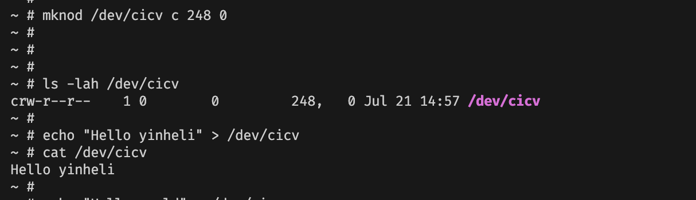

# 作业5：注册字符设备


```bash
ls -lah /dev/cicv
```


```bash
echo "Hello yinheli" > /dev/cicv
```

```bash
cat /dev/cicv
```




> 字符设备/dev/cicv是怎么创建的？它的设备号是多少？它是如何与我们写的字符设备驱动关联上的？

- mknod 创建
- build_image.sh 中指定了 248 0 （主设备号 248, 次设备号 0）
- 代码里 `chrdev::Registration::new_pinned` 和 mknod 创建的次设备号 关联
